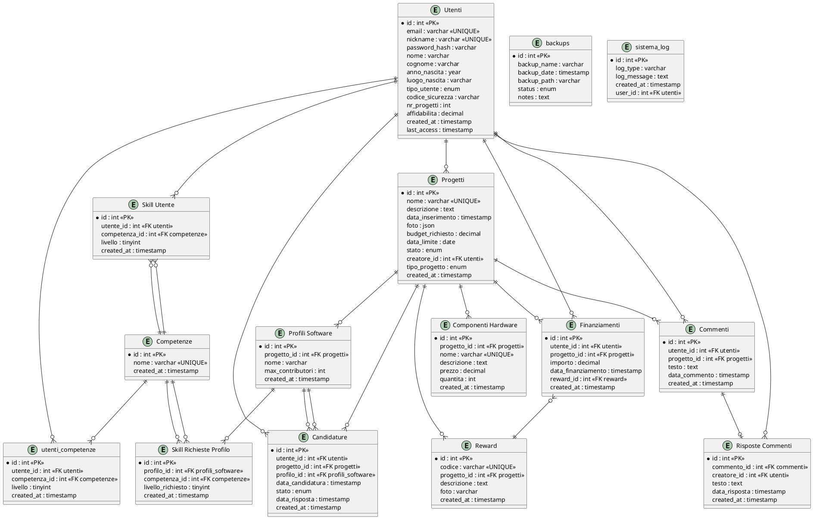

# SCHEMA RELAZIONALE BOSTARTER (A.A. 2024/2025)

## Utenti

- id (PK)
- email (univoco)
- nickname (univoco)
- password_hash
- nome
- cognome
- anno_nascita
- luogo_nascita
- tipo_utente (standard/creatore/amministratore)
- codice_sicurezza (solo admin)
- nr_progetti (solo creatore, ridondanza)
- affidabilita (solo creatore)
- created_at
- last_access

## Competenze

- id (PK)
- nome (univoco)
- created_at

## Skill Utente

- id (PK)
- utente_id (FK utenti)
- competenza_id (FK competenze)
- livello (0-5)
- created_at

## Progetti

- id (PK)
- nome (univoco)
- descrizione
- data_inserimento
- foto (JSON)
- budget_richiesto
- data_limite
- stato (aperto/chiuso)
- creatore_id (FK utenti)
- tipo_progetto (hardware/software)
- created_at

## Reward

- id (PK)
- codice (univoco)
- progetto_id (FK progetti)
- descrizione
- foto
- created_at

## Componenti Hardware

- id (PK)
- progetto_id (FK progetti)
- nome (univoco per progetto)
- descrizione
- prezzo
- quantita (>0)
- created_at

## Profili Software

- id (PK)
- progetto_id (FK progetti)
- nome
- max_contributori
- created_at

## Skill Richieste Profilo

- id (PK)
- profilo_id (FK profili_software)
- competenza_id (FK competenze)
- livello_richiesto (0-5)
- created_at

## Finanziamenti

- id (PK)
- utente_id (FK utenti)
- progetto_id (FK progetti)
- importo
- data_finanziamento
- reward_id (FK reward)
- created_at

## Commenti

- id (PK)
- utente_id (FK utenti)
- progetto_id (FK progetti)
- testo
- data_commento
- created_at

## Risposte Commenti

- id (PK)
- commento_id (FK commenti, univoco)
- creatore_id (FK utenti)
- testo
- data_risposta
- created_at

## Candidature

- id (PK)
- utente_id (FK utenti)
- progetto_id (FK progetti)
- profilo_id (FK profili_software)
- data_candidatura
- stato (pending/accepted/rejected)
- data_risposta
- created_at

## Tabelle di supporto

- utenti_competenze (relazione molti-a-molti utenti/competenze, con livello)
- backups (log backup database)
- sistema_log (log eventi di sistema)

## Trigger principali

- Aggiornamento affidabilità creatore (ogni nuovo progetto e ogni finanziamento)
- Incremento/decremento nr_progetti
- Chiusura automatica progetto al raggiungimento del budget

## Eventi

- Chiusura automatica progetti scaduti (1 volta al giorno)

## Stored Procedure

- Tutte le operazioni CRUD principali (registrazione, login, inserimento skill, progetti, reward, finanziamenti, commenti, candidature, ecc.)

## Viste

- Top 3 creatori per affidabilità
- Top 3 progetti vicini al completamento
- Top 3 utenti per finanziamenti erogati

---

Questo schema è conforme alla traccia PDF e riflette la struttura reale del database BOSTARTER.

---

## Schema ER (PlantUML)

---

Questo schema ER è conforme alla traccia PDF e riflette le relazioni reali nel database BOSTARTER.
